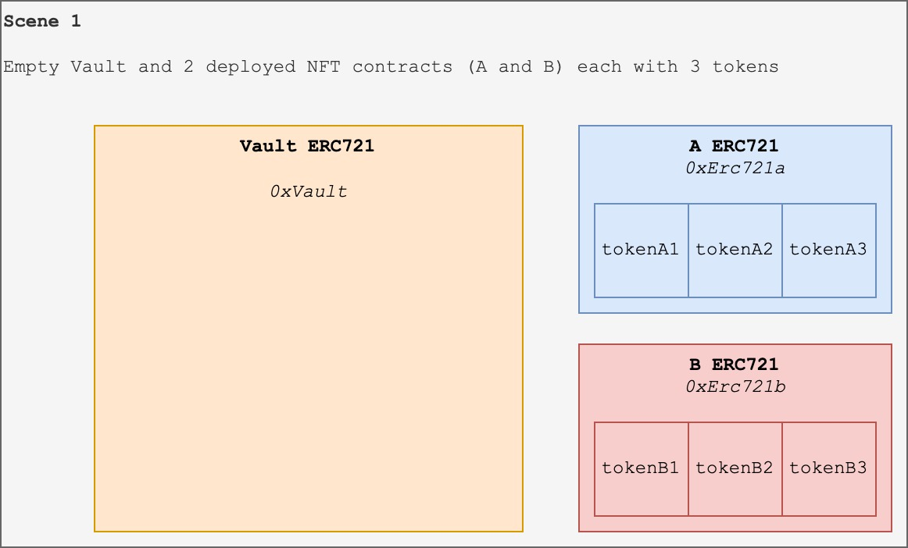
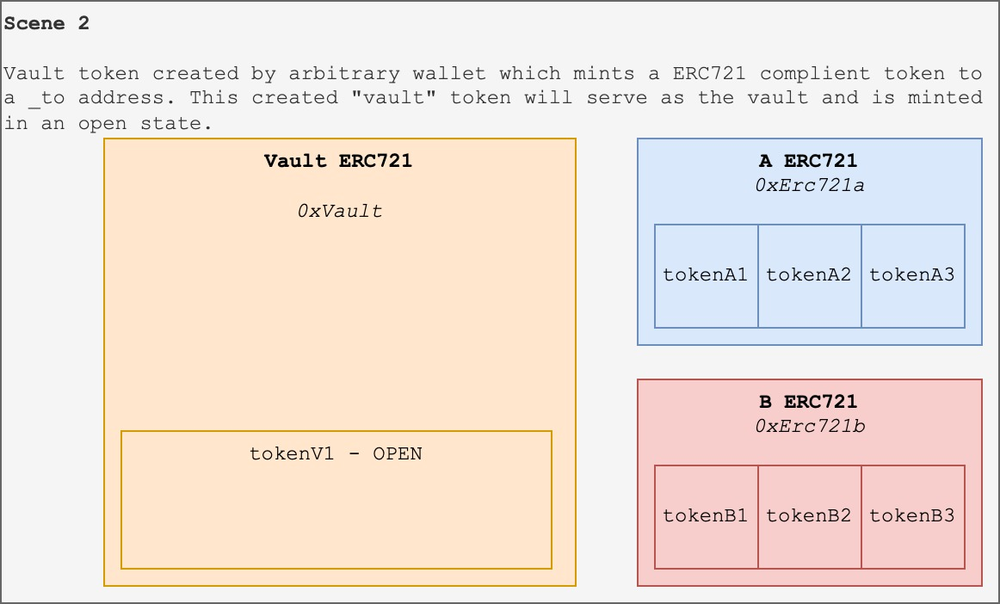
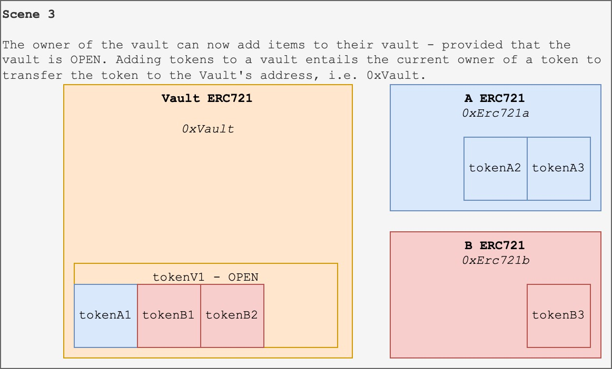
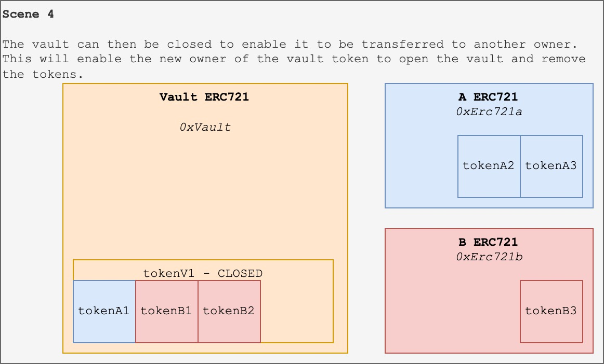
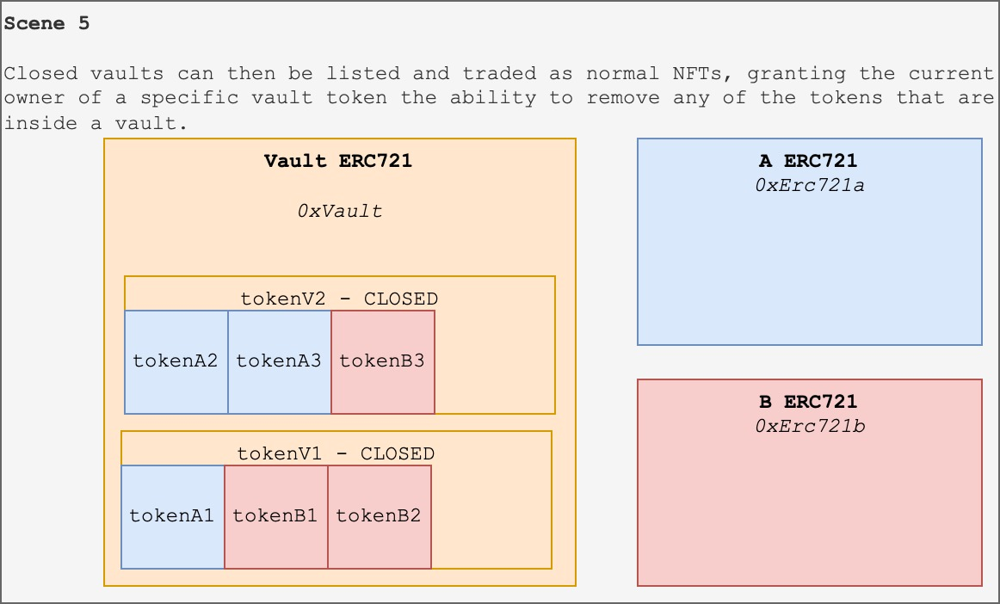

# ERC721 Vault

## Introduction

This repo serves as supporting material for this EIP which proposes an ERC721 Vault contract which itself is also an ERC721. As the popularity of NFTs are growing, the amount of NFTs owned and transferred by users are following suit. This standard would allow users as well as organisations to package multiple NFTs into a consolidated vault NFT which only the owner of the vault can interact with.

## Graphical Overview

### Scene 1

<div align="center">
    
</div>

### Scene 2

<div align="center">
    
</div>

### Scene 3

<div align="center">
    
</div>

### Scene 4

<div align="center">
    
</div>

### Scene 5

<div align="center">
    
</div>

## Hardhat Commands

```shell
npx hardhat accounts
npx hardhat compile
npx hardhat clean
npx hardhat test
npx hardhat node
npx hardhat help
REPORT_GAS=true npx hardhat test
npx hardhat coverage
npx hardhat run scripts/deploy.js
node scripts/deploy.js
npx eslint '**/*.js'
npx eslint '**/*.js' --fix
npx prettier '**/*.{json,sol,md}' --check
npx prettier '**/*.{json,sol,md}' --write
npx solhint 'contracts/**/*.sol'
npx solhint 'contracts/**/*.sol' --fix
```
